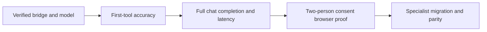

# Agent Chat migration measurements

This record separates saved measurements from checkpoint claims. Specialist migrations have not yet passed their before/after gates. Historical artifacts remain under `consent-protocol/artifacts/regression/before/` (ignored).

## Visual Map



Each gate requires its own evidence. Passing first-tool accuracy does not prove successful tool execution, persisted chat completion, or consent behavior.

## Before evidence

| Measurement | Revision | Result | Limitation |
| --- | --- | --- | --- |
| One first-tool, Gemini 3.7 Flash, two repetitions | `d81ada537879e7ba8125165df81572e3c18ad22b` | 46/52 cases; p50 5,126.2 ms, p95 16,238.6 ms | Saved artifact fails overall, Calendar and Finance gates. The older checkpoint reports 52/52 after widening six expectations; that is not a fresh model run. |
| One first-tool, Gemini 3.7 Flash, fresh two-repetition run | `207792d6bc45625fe4adb40f5d0f6936fd7247f3` | **52/52**, all eight families pass; 104 calls | Current revised fixture. Timings p50 5,208.0 ms / p95 11,557.6 ms include the old two-second pacing delay; not pure inference latency. |
| Nav keyword shim, 22 cases × 3 repetitions | `b80a2169ed5d7f00f4f23b417403e9834e2317b5`, dirty harness additions | First-tool-equivalent and shape: 14/22 (63.64%); p50 0.603 ms, p95 0.754 ms | Fixture-backed service calls, no model calls or network latency. `effective_model=null`; model labels are comparison metadata only. |
| Agent Chat route, 10 prompts × 3 | Historical September 14 checkpoint; artifact has no source revision | 28/30 finished; first-visible p50 8,823.6 ms / p95 53,413.7 ms; total p50 19,708.7 ms / p95 69,638.2 ms | Quota-distorted, two execution-bound failures; server timing unmatched. Not a comparable release baseline. |
| Agent Chat route, fresh 3.7, 10 prompts × 3 | `207792d6bc45625fe4adb40f5d0f6936fd7247f3`, isolated no-reload backend | **25/30 finished**; first-visible p50 5,453 ms / p95 27,975 ms; total p50 9,420 ms / p95 77,941 ms | All 30 persisted model receipts verify 3.7. Three finance serialization errors, one Vertex 429 and one timeout remain failures. Both latency ceilings fail. |
| Gemini 3.8 Flash, global | Integration of `b80a2169e` and `a1850ff4b`, uncommitted merge | Initial attempt: HTTP 499; repeat: 9 completed cases, then HTTP 504 after 399,288.6 ms | Repaired harness saved completed repetitions and marked 43 cases incomplete/unattempted. Accuracy is null; the gate fails. User authorized continuing on 3.7. |

Historical Gemini 3.7 saved family accuracy (the fresh run passes all families):

| Family | Correct / total |
| --- | --- |
| Consent | 13/13 |
| Delegation | 5/5 |
| Email | 5/5 |
| Location | 8/8 |
| Memory | 4/4 |
| General | 5/6 |
| Finance | 5/7 |
| Calendar | 1/4 |

The fresh first-tool accuracy run is saved under `artifacts/regression/before-20260914-continuation/`. The pacing correction is committed as `f6cc98d1d`; subsequent reports identify timing semantics explicitly and exclude harness pacing while retaining provider retries. Do not silently rewrite old timings.

The fresh route report and model receipts are retained in the same dated artifact directory. Finance failures reproduce `PydanticSerializationError` during encrypted session encoding; the memory failure is HTTP 429 `RESOURCE_EXHAUSTED` (capacity versus quota is not established). The consent timeout was caused by the driver’s old 90-second deadline, before the backend’s 120-second execution bound; backend generation finalized about one second after the client disconnected. Subsequent measurements must explicitly record the corrected window. A slow consent turn includes approximately 31 seconds before its tool and 54 seconds after it, without a correlated provider retry. These are separate causes, not evidence that every delay is quota-related.

The isolated measurement server was stopped after receipt verification; its port was confirmed closed. Commit `bab92576e` corrects telemetry that previously relabeled terminal streams as client disconnects when consumers closed them. It passed the full backend runner: 3,052 passed, 111 skipped. This telemetry correction does not turn failed chats into successes.

## Reproduction

Run from `consent-protocol` with the existing environment loaded in process; never copy credentials into reports.

```sh
.venv/bin/python scripts/eval_one_first_tool.py --model gemini-3.8-flash --reps 2 --report-dir artifacts/regression/before
.venv/bin/python scripts/eval_specialist_turns.py --specialist nav --mode baseline --model both --runs 3 --report artifacts/regression/before/nav_specialist_turns.json
```

The specialist harness exercises the public handler with synthetic service fixtures. The migrated source supports `--mode adk` and rejects baseline mode so it cannot mislabel model calls as the old keyword runtime. Infrastructure errors are not tool-selection misses; incomplete runs fail the gate and retain unattempted cases. Do not overwrite historical artifacts when collecting comparable before/after runs.

## Current prerequisites

- Local and UAT Gemini configuration both select `hushh-vertex-personal54` with `global`; native UAT infrastructure remains `hushh-pda-uat`. The personal account is confirmed project owner. Local ADC authenticates as `kushal@hushh.ai`; selecting the bridge project does not require replacing infrastructure credentials. This checks routing, not billing-credit availability.
- The user waived two-person reviewer browser acceptance. It was not run and is not reported as passed; counterpart setup is no longer a prerequisite.
- Real PostgreSQL lifecycle proof passed with the complete canonical legacy schema plus current init/release migrations. Empty-database `--init` alone still lacks the Gmail foundation required by migration 039.
- `tests/test_pod_architecture_is_authoritative.py` is absent from this branch. The old plan names a gate from another branch; it must not be reported as passed here.
- Official A2A compatibility remains `ADK_A2A_SDK_MATRIX_UNVERIFIED` despite the local hierarchy/compliance checks passing.

## Targeted runtime corrections

Commit `77a842056` repairs deferred SDK model serialization before encrypted persistence, preserving the original event objects and encryption format. Regression coverage is now included in the backend CI manifest. With the driver-window regression in `82c7f2acb`, the full backend runner passed **3,061 tests**, with **111 skipped**. The driver now allows 120 seconds; first-visible and total latency ceilings remain 8 and 30 seconds.

A targeted repeat of the identical finance prompt completed **3/3**, versus **0/3** before. All three persisted model receipts confirm Gemini 3.7 Flash. First-visible p95 was **7,745 ms**; total p95 **32,558 ms** still exceeds the unchanged 30-second performance ceiling. This proves the observed serialization failure is resolved in this run, not general performance acceptance. Reports remain under `artifacts/regression/serialization-fix-20260914/`.

Consent visibility also completed **3/3** with the corrected 120-second driver window, and persisted receipts confirmed 3.7 for all three. Durations were **72.7, 98.4 and 104.7 seconds**. First-visible p95 **70,680 ms** and total p95 **104,029 ms** fail the unchanged performance gates. The two longer turns demonstrate why the old 90-second cutoff was premature; they do not establish acceptable latency.

A single memory-preference recheck completed in **10,963 ms**, passed its latency bounds, and persisted a 3.7 model receipt. No 429 recurred in this recheck; one successful retry does not prove provider quota or capacity issues are eliminated. All seven targeted follow-up chats completed. The task-owned server was stopped afterward and its port was verified closed.

## After evidence

No specialist migration has landed in this continuation. Record each phase revision, identical fixtures/model/configuration, per-family accuracy, latency and retained failures here before claiming parity.

### Phase G routing decisions

Calendar remains on One's existing deterministic toolset. The measured Gemini 3.7
first-tool gate was **1/4** for the Calendar family, below the migration precondition;
no `ask_calendar_agent` child was introduced. Re-run the comparable family fixture
before reconsidering that boundary. KYC's four bounded drafting and extraction calls
are now manifest-owned single-turn genes, with the current service contracts and
unit fakes preserved for deterministic tests.

### Phase A live specialist evaluation

The unchanged 22 Nav cases were evaluated through the real public Nav/Consent ADK path on Gemini 3.7, personal54/global. These are synthetic service fixtures with real model calls, not browser or production proof.

| Run | Completed attempts | Strict first-tool / shape | p50 | p95 | Failure evidence |
| --- | --- | --- | --- | --- | --- |
| Initial diagnostic, 1 repetition | 19/22 | 19/22 | 8,881ms | 16,578ms | timeout, resource exhaustion, one ambiguous-question mismatch |
| Low thinking, no redundant root summary, 3 repetitions | 57/66 | 14/22 each | 6,823ms | 22,707ms | seven event timeouts, two resource-exhaustion errors |
| Progress-aware timeout correction, 3 repetitions | 56/66 | 13/22 each | 6,466ms | 22,434ms | seven progress-correlated timeouts, three quota errors |

The first three-repetition run observed 155 model requests. The progress-aware correction observed 150. Every completed attempt matched both tool and shape expectations. All repetitions must pass for a case to pass; failures remain in the denominator. All four unchanged gates failed on both runs: 90% first-tool, 90% shape, p50 ≤4s and p95 ≤8s. No provider failure is relabeled as successful model behavior. The corrected run recorded nested model and tool callbacks as progress; each timeout occurred about 20 seconds after the last observed progress, so it does not prove that the provider was still advancing silently.

A preceding run was interrupted at the user's pause request and is not a completed measurement. Its partial log remains preserved. Complete reports are under `consent-protocol/artifacts/regression/phase-a/`, including `nav-adk-37-acceptance-resumed.json`. The measured dirty source was based on `d7c0ce99a` and preserved under the integration worktree's `tmp/phase-a-measured-source/` before subsequent edits. These measurements do not cover A2's later Connections and authority changes.

The shared execution foundation is committed as `06e3373a7`; strict owner/hop primitives as `6e6d150cc`; nested-progress correction as `f2a916a4d`. Phase A's earlier frozen-source checks passed 3,092 backend tests (111 skipped) and 7,146 web tests (six skipped). These passing suites do not override failed live acceptance or establish completion of the remaining migration phases.
